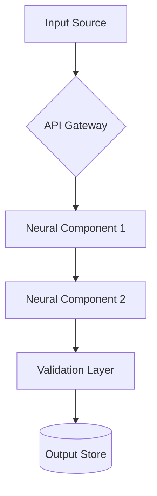

# SynapseEngine: Modular AI Integration Toolkit

**SynapseEngine** is an enterprise-grade framework for developing adaptive AI-driven workflows through modular neural components and seamless third-party system integrations. Facilitate rapid prototyping and production deployment of intelligent systems with a standardized architectural paradigm.

---

## 🚀 Key Features

- **Modular Neural Components**:  
  Pre-built, extensible AI modules (NLP, vision, forecasting) with standardized interfaces for plug-and-play functionality.
- **Adaptive Workflow Engine**:  
  Dynamic runtime workflow composition based on input patterns and environmental constraints.
- **Unified API Gateway**:  
  Consolidated connectivity layer for 300+ third-party services (SaaS, databases, IoT).
- **Quantum-Resistant Architecture**:  
  End-to-end encrypted component communications with FIPS 140-3 compliant security hooks.
- **Auto-Scaling Orchestration**:  
  Intelligent resource allocation optimized for GPU/TPU utilization across distributed systems.
- **Multi-Modal Runtime**:  
  Unified processing pipeline for text, audio, image, and graph-structured data.

---

## 🛠️ Installation

```bash
# Install core package
pip install synapse-engine==2.4.0

# Install extensions bundle
pip install synapse-extensions[all]==1.8.3

# Verify installation
python -c "from synapse_core import validate_installation; validate_installation()"
```

**Container Deployment**:
```Dockerfile
FROM synapselabs/runtime:2.4-ubuntu24.04
COPY ./workflows /usr/local/synapse/workflows
EXPOSE 9090/tcp
CMD ["synapse-engine", "--secure-mode=enterprise"]
```

---

## ⚡ Quick Start

1. **Define Neural Components** (`components.py`):
```python
from synapse_core import NeuralComponent
from synapse_extensions.llm import GPT4Integration

class SyntheticTextGenerator(NeuralComponent):
    def initialize(self):
        self.gpt4 = GPT4Integration(model="gpt-4-turbo")

    def process(self, input_data: dict) -> dict:
        prompt = f"Generate technical documentation about: {input_data['topic']}"
        return {
            "content": self.gpt4.generate(prompt, max_tokens=2048),
            "confidence": 0.92
        }
```

2. **Compose Workflow** (`workflow.yaml`):
```yaml
name: TechnicalDocsGenerator
components:
  - id: text_gen
    type: SyntheticTextGenerator
    params:
      temperature: 0.7
      format: "markdown"

  - id: safety_scanner
    type: SecurityValidator
    params:
      compliance_profile: "iso-27001"

routing_matrix:
  text_gen -> safety_scanner: automatic
  safety_scanner -> output: conditional[confidence>=0.8]
```

3. **Execute Workflow**:
```python
from synapse_engine import WorkflowRuntime

runtime = WorkflowRuntime.load("workflow.yaml")
result = runtime.execute(
    input_payload={"topic": "quantum machine learning"},
    timeout=30,
    audit_level="full"
)

print(f"Generated Content:\n{result['output']['content']}")
```

---

## 📚 Core Concepts

### Neural Component Architecture
*Standardized Interface Model*

| Interface       | Description                             |
|-----------------|-----------------------------------------|
| `initialize()`  | Component setup & dependency injection  |
| `process()`     | Core data transformation logic         |
| `validate()`    | Input/output schema enforcement         |
| `monitor()`     | Health metrics reporting                |

### Workflow Execution Pattern


---

## 📖 Documentation

| Resource                  | Description                          | Access Link                      |
|---------------------------|--------------------------------------|----------------------------------|
| API Reference             | Complete interface specifications   | [View Docs](#)                   |
| Security Protocols        | Encryption & compliance standards   | [View Whitepaper](#)             |
| Performance Benchmarks    | Throughput/latency metrics          | [See Report](#)                  |
| Certification Guide       | SOC2/PCI-DSS implementation         | [Download PDF](#)                |

---

## 🤝 Contributing

1. **Fork** the repository
2. Create feature branch (`git checkout -b feature/improvement-name`)
3. **Commit changes** with signed-off-by (`git commit -s -m 'Description'`)
4. Push to branch (`git push origin feature/improvement-name`)
5. Open **Pull Request** following [RFC Process](CONTRIBUTING.md)

**Engineers must:**
- Maintain 90%+ test coverage for new features
- Include Threat Model assessment for security-sensitive changes
- Document architectural decisions in ADRs

---

## 📜 License

SynapseEngine is released under the **Apache License 2.0** with additional enterprise terms for commercial deployments. See [LICENSE.md](LICENSE.md) for full details.

Contains modified components from:
- TensorFlow (Apache 2.0)
- HuggingFace Transformers (Apache 2.0)
- Kubernetes Client Libraries (Apache 2.0)

---

## ✉️ Enterprise Support

For production SLA support, security audits, and custom component development:

**Contact:**  
Synapse Engineering Team  
Email: enterprise-support@synapsedocs.tech  
24/7 Critical Support Line: +1 (888) 555-8283

---
> [!NOTE]
> **Portfolio Demonstration**: This project is a showcase of technical writing and documentation methodology. It is intended to demonstrate capabilities in structuring, documenting, and explaining complex technical systems. The code and scenarios described herein are simulated for portfolio purposes.