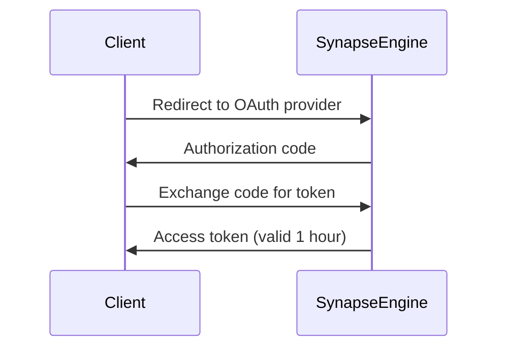

# SynapseEngine Authentication Guide

## Overview  
All SynapseEngine API endpoints require authentication to ensure secure access to AI workflows and third-party integrations. This document outlines the supported authentication methods and protocols.

---

## Authentication Methods

### API Keys (Recommended)
Authenticate via encrypted API keys passed in request headers.  

**Key Generation:**  
1. Navigate to **Project Settings > Security** in the SynapseEngine Dashboard.  
2. Click **Generate API Key**.  
3. Securely store the generated key (shown only once).  

**Usage:**  
Include your API key in the `Authorization` header:  
```http
Authorization: SE-Key YOUR_API_KEY
```

### OAuth 2.0 (Third-Party Integrations)
Use OAuth 2.0 for delegated access to external services.  

**Flow:**  


**Scopes Required:**  
- `workflow:execute`  
- `neurons:read_write`  

---

## Obtaining Credentials
| Credential Type | Location | Validity |  
|-----------------|----------|----------|  
| API Key         | Dashboard | Until revoked |  
| OAuth Token     | `/oauth/token` endpoint | 1 hour |  

---

## Making Authenticated Requests

### cURL Example
```bash
curl -X POST https://api.synapseengine.com/v1/workflows/run \
  -H "Authorization: SE-Key sk_live_xyz123" \
  -H "Content-Type: application/json" \
  -d '{"workflow_id": "wf_789"}'
```

### Python Example
```python
import requests

headers = {
    "Authorization": "SE-Key sk_live_xyz123",
    "Content-Type": "application/json"
}

response = requests.post(
    "https://api.synapseengine.com/v1/neurons/list",
    headers=headers
)
```

### JavaScript Example
```javascript
fetch('https://api.synapseengine.com/v1/models/predict', {
  method: 'POST',
  headers: {
    'Authorization': 'SE-Key sk_live_xyz123',
    'Content-Type': 'application/json'
  },
  body: JSON.stringify({ input_data: [...] })
});
```

---

## Error Handling

### Common Authentication Errors
| Code | Error | Resolution |  
|------|-------|------------|  
| 401  | `invalid_api_key` | Regenerate key in Dashboard |  
| 403  | `oauth_scope_missing` | Request additional scopes |  
| 419  | `token_expired` | Refresh OAuth token |  

---

## Security Best Practices
1. **Key Rotation:** Regenerate API keys quarterly or after personnel changes  
2. **Environment Variables:** Never hardcode keys in source files:  
   ```bash
   export SYNAPSE_KEY='sk_live_xyz123'
   ```
3. **IP Whitelisting:** Restrict key usage to approved networks via Dashboard  
4. **HTTPS Enforcement:** All API traffic must use TLS 1.3+  

---

## Support  
Contact `security@synapseengine.com` for:  
- Suspicious activity reporting  
- Emergency key revocation  
- OAuth scope modification requests  

> **Note:** Audit logs for all authentication events are available in **Dashboard > Activity**.