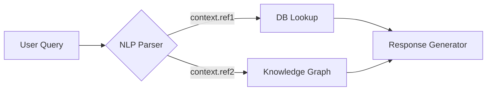

# SynapseEngine Core Data Model

## Overview
The SynapseEngine data model defines the structural framework for constructing AI workflows by representing computation, data flow, and system interactions as a directed graph. This model enables the composition of modular neural components and third-party services into executable pipelines.

---

## Key Constructs

### 1. Nodes
Processing units that encapsulate atomic operations. Nodes implement one of three fundamental types:

| Type          | Description                              | Properties                                  |
|---------------|------------------------------------------|---------------------------------------------|
| **Processor** | Pure computation (ML models, algorithms) | `cpu/gpu资源配置`, `batch_size`, `model_version` |
| **Connector** | I/O operations (APIs, databases)         | `endpoint`, `auth_type`, `rate_limit`       |
| **Aggregator**| Multi-input operations (decision logic)  | `fusion_method`, `decision_threshold`       |

**Node Template:**
```yaml
type: processor.transformer
id: sentiment_analyzer_v3
config:
  framework: pytorch
  precision: fp16
  inputs:
    text: { type: string, min_length: 1 }
  outputs:
    sentiment: { type: float, range: [-1,1] }
```

### 2. Edges
Directional data pathways with three critical capabilities:

1. **Schema Validation**
   - Runtime type checking with JSON Schema
   - Automatic tensor shape adaptation
2. **QoS Controls**
   - Priority queuing (LIFO/FIFO)
   - Throughput throttling
3. **Data Transformation**
   - Protocol buffers ↔ JSON conversion
   - Dimensionality reduction

**Edge Contract Enforcement:**
```python
class EdgeValidator:
    def enforce_schema(source_output, target_input):
        if not validate_using_json_schema(source_output, target_input.schema):
            apply_auto_cast_rules() or raise SchemaViolationError
```

### 3. Context Objects
Shared state containers propagating through the execution graph:



**Context Structure:**
```json
{
  "request_id": "uuidv4",
  "timestamps": {
    "ingest": "ISO8601",
    "processing_start": "ISO8601"
  },
  "security_profile": "SECRET-L3",
  "data_contract": "https://.../contract_v12.jsonld"
}
```

---

## Schema Definitions
Standardized descriptions using OpenAPI 3.1 conventions:

```json
{
  "$schema": "https://json-schema.org/draft/2020-12/schema",
  "title": "ImageProcessorOutput",
  "type": "object",
  "required": ["embeddings", "metadata"],
  "properties": {
    "embeddings": {
      "type": "array",
      "x-ai-type": "tensor<float32>",
      "dimensions": [ null, 512 ]
    },
    "metadata": {
      "type": "object",
      "patternProperties": {
        "^[a-z0-9_]+$": { "anyOf": [ "number", "string" ] }
      }
    }
  }
}
```

---

## Execution Lifecycle

1. **Graph Initialization**
   - Topological sorting with cycle detection
   - Resource allocation profiling
2. **Data Propagation**
   - Just-in-time tensor materialization
   - Context-aware caching
3. **Error Handling**
   - Per-edge dead-letter queues
   - Circuit breaker patterns
   - Automatic checkpoint rollbacks
4. **Observability**
   - Distributed tracing (OpenTelemetry)
   - Data lineage tracking

---

## Version Control Strategy

| Compatibility Level | Requirements                         | Example              |
|---------------------|--------------------------------------|----------------------|
| **Strict**          | SHA-256 hash match                   | Model binaries       |
| **Lax**             | Semantic version ± patch             | API wrappers         |
| **Forward**         | Node-defined upgrade adapters        | Database schemas     |

```python
def handle_version_mismatch(node_v1, node_v2):
    if node_v1.compatibility_level == "strict":
        require_identical_versions()
    elif node_v1.compatibility_level == "forward":
        apply_auto_upgrade(node_v1.migration_scripts)
```

---

## Visual Representation
Standard graph notation with augmented semantics:

```plaintext
[Camera Ingestion]-(raw_frame)
  -> [Frame Normalizer]-(tensor)
  -> {
       [Object Detector]-(bboxes),
       [Depth Estimator]-(z_index)
      }
  -> [Scene Composition]-(3d_scene)
```

---

## Best Practices
1. Maintain idempotent node operations
2. Apply the Principle of Least Privilege to connector configurations
3. Use version-pinned schema references
4. Implement circuit breakers on critical edges

This model enables deterministic execution while supporting adaptive neural architectures through its self-describing component contracts and context-aware data flow mechanics.