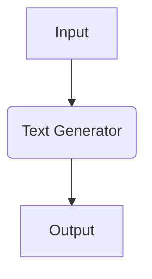

# SynapseEngine "Hello World" Tutorial

## Overview
This tutorial guides you through creating your first adaptive workflow using SynapseEngine's core components. You'll implement a basic text processing pipeline that demonstrates modular AI component integration.

**Learning Objectives:**
- Initialize a SynapseEngine instance
- Construct a simple neural workflow
- Execute synchronous processing
- Retrieve and interpret AI outputs

---

## Prerequisites
- Python 3.8+ environment
- Valid SynapseEngine API key
- Basic terminal/Python knowledge

---

## Setup
1. Install the SDK:
```bash
pip install synapse-engine==1.4.0
```

2. Set your API key:
```bash
export SYNAPSE_API_KEY='your_api_key_here'
```

---

## Workflow Implementation

### Step 1: Engine Initialization
```python
from synapse_engine import CoreEngine

engine = CoreEngine(
    runtime="cloud", 
    api_key=os.environ['SYNAPSE_API_KEY']
)
```

### Step 2: Component Definition
```python
text_generator = engine.load_component(
    "neural/text-gen@v3",
    params={
        "model": "gpt-3.5-turbo",
        "temperature": 0.7
    }
)
```

### Step 3: Workflow Composition
```python
with engine.new_session() as workflow:
    input_node = workflow.receive("text/plain")
    processed = text_generator(input_node, prompt="Generate a welcome message:")
    workflow.emit(processed, "output/text")
```

### Step 4: Execution
```python
response = workflow.execute(
    inputs={"input_node": "Hello World"},
    timeout=30
)

print(f"AI Response: {response.outputs['output/text']}")
```

### Step 5: Output Handling
```python
if response.status == "COMPLETED":
    print(f"Final Output:\n{response.outputs['output/text']}")
else:
    print(f"Error: {response.error_message}")
```

---

## Sample Output
```
AI Response: Welcome to the SynapseEngine ecosystem! Your journey into adaptive AI workflows begins now.
```

---

## Best Practices
1. **Session Management**
   - Always use context managers (`with` blocks) for workflow sessions
   - Validate component compatibility before execution

2. **Error Handling**
   ```python
   try:
       response = workflow.execute(...)
   except EngineRuntimeError as e:
       print(f"Execution failed: {e.code} - {e.details}")
   ```

3. **Resource Cleanup**
   ```python
   workflow.terminate()  # Manual termination if not using context manager
   ```

---

## Next Steps
1. Explore prebuilt components in the Component Library
2. Implement error fallback workflows
3. Add conditional processing branches



> **Documentation Reference**:  
> [Core Concepts](https://docs.synapseengine.ai/core-concepts) |  
> [Component Library](https://docs.synapseengine.ai/components)  

--- 

*SynapseEngine Documentation v1.4 - © 2023 Synapse Technologies*