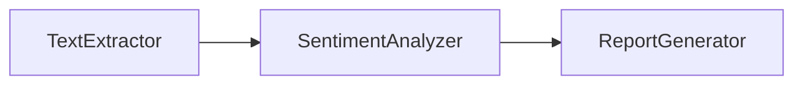
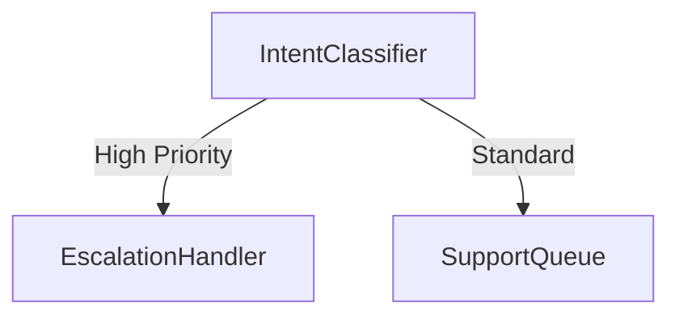
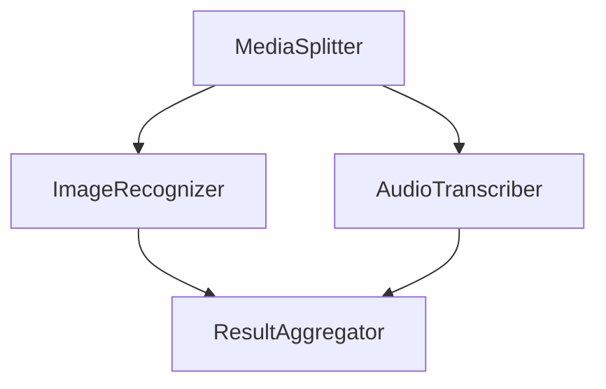
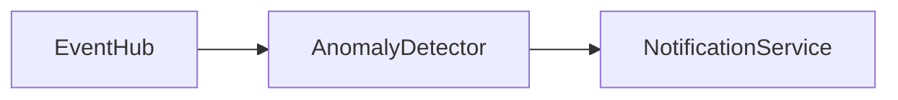

# SynapseEngine Integration Patterns  

This document provides implementation strategies for common workflow integration scenarios using SynapseEngine. Each pattern includes an architectural diagram, applicable use cases, and implementation guidelines.  

---

## 1. Sequential Processing Pattern  
**Use Case**: Linear data transformation pipelines (e.g., document processing).  

### Architecture  


### Implementation Steps  
1. **Configure Input Source**:  
   Bind the `TextExtractor` neural component to an input source (e.g., cloud storage bucket).  
2. **Chain Components**:  
   Connect the output of `TextExtractor` to `SentimentAnalyzer`, then route results to `ReportGenerator`.  
3. **Deploy Workflow**:  
   Use the SynapseEngine CLI:  
   ```bash
   synapse deploy -f workflow_sequential.yaml
   ```  

---

## 2. Conditional Routing Pattern  
**Use Case**: Dynamic workflow branching (e.g., customer support ticket classification).  

### Architecture  


### Implementation Steps  
1. **Define Decision Logic**:  
   Configure `IntentClassifier` thresholds for "High Priority" vs. "Standard" intents.  
2. **Route Outputs**:  
   Map classifier results to downstream services using JSONPath expressions:  
   ```yaml
   routing_rules:
     - when: $.intent.confidence >= 0.85
       target: EscalationHandler
     - default: SupportQueue
   ```  
3. **Validate Routing**:  
   Test with edge cases using the SynapseEngine Simulator.  

---

## 3. Parallel Execution Pattern  
**Use Case**: Multimodal data processing (e.g., image + audio analysis).  

### Architecture  


### Implementation Steps  
1. **Enable Parallelism**:  
   Set the `parallelism` flag to `true` in the workflow configuration.  
2. **Synchronize Outputs**:  
   Configure `ResultAggregator` with a timeout (e.g., `max_wait_seconds: 30`).  
3. **Monitor Performance**:  
   Use the SynapseEngine Dashboard to track thread utilization.  

---

## 4. Fallback Handling Pattern  
**Use Case**: Resilient external API integrations (e.g., payment processing).  

### Architecture  


### Implementation Steps  
1. **Define Failure Conditions**:  
   Set error code triggers (e.g., HTTP 429/503) to activate fallbacks.  
2. **Configure Retry Logic**:  
   ```yaml
   fallback_strategy:
     retry_attempts: 2
     timeout_ms: 5000
     backup_component: "FallbackPaymentGateway"
   ```  
3. **Log Diagnostics**:  
   Enable the `debug_fallback` metadata header for traceability.  

---

## 5. Event-Driven Processing Pattern  
**Use Case**: Real-time stream processing (e.g., IoT sensor alerts).  

### Architecture  


### Implementation Steps  
1. **Subscribe to Events**:  
   Configure `EventHub` with a webhook endpoint or message queue subscription.  
2. **Optimize Streaming**:  
   Enable `streaming_mode: low_latency` in the component manifest.  
3. **Scale Dynamically**:  
   Attach autoscaling policies based on event throughput.  

---

## Best Practices  
1. **Stateless Design**:  
   Externalize session/context data to Redis or equivalent.  
2. **Idempotency Keys**:  
   Inject `X-Idempotency-Key` in all mutating API calls.  
3. **Circuit Breakers**:  
   Configure fault tolerance thresholds for third-party services.  
4. **Validation Gates**:  
   Add schema validators before critical workflow stages.  

--- 

These patterns serve as foundational templates for composing production-grade workflows. Adapt parameters to match your latency, compliance, and scalability requirements.  